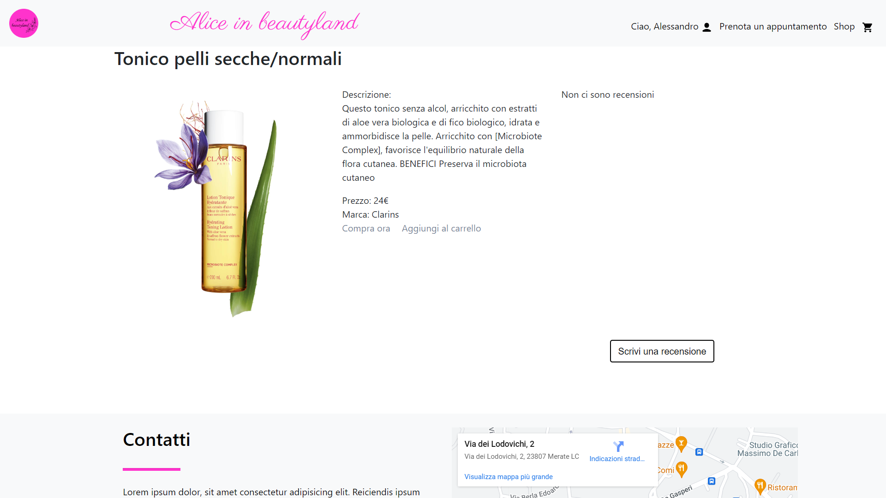
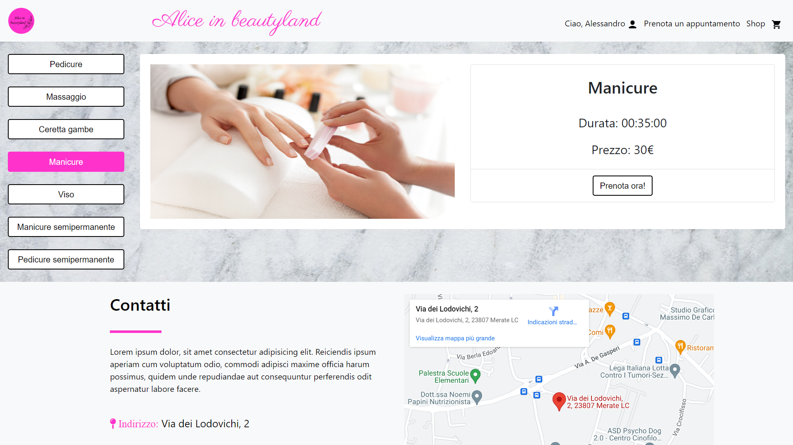
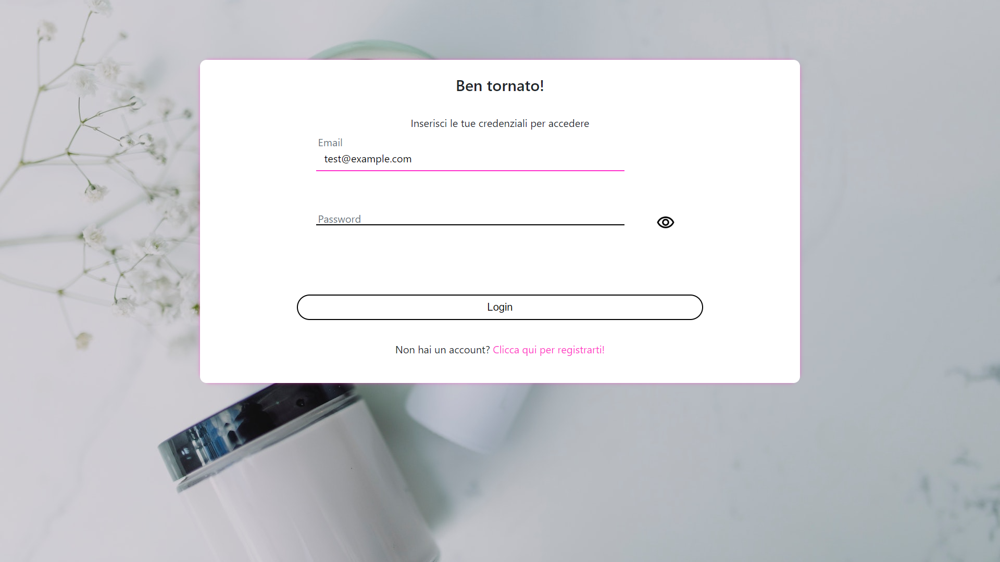
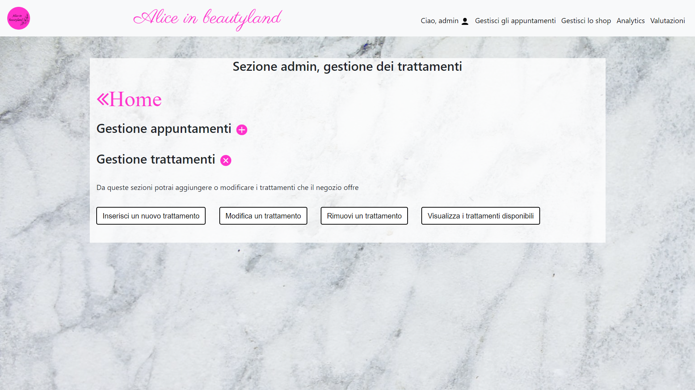
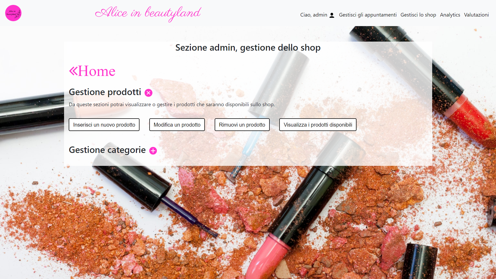
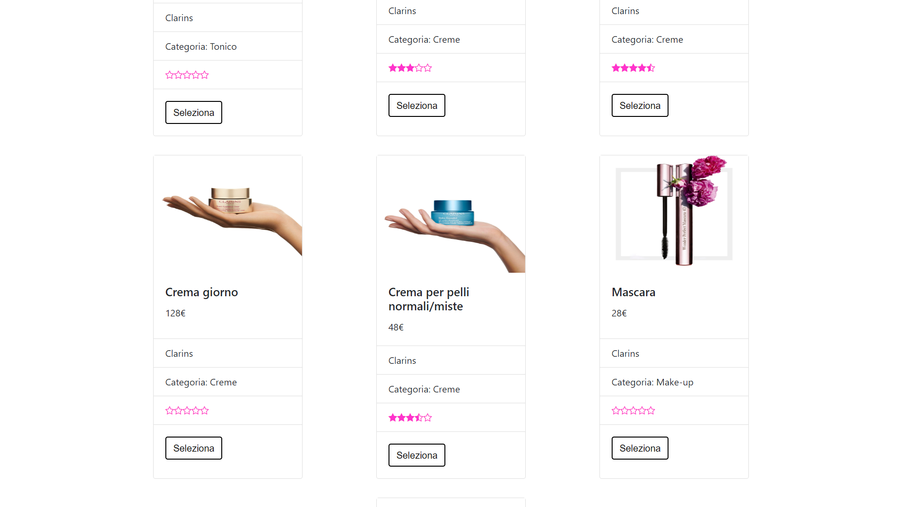
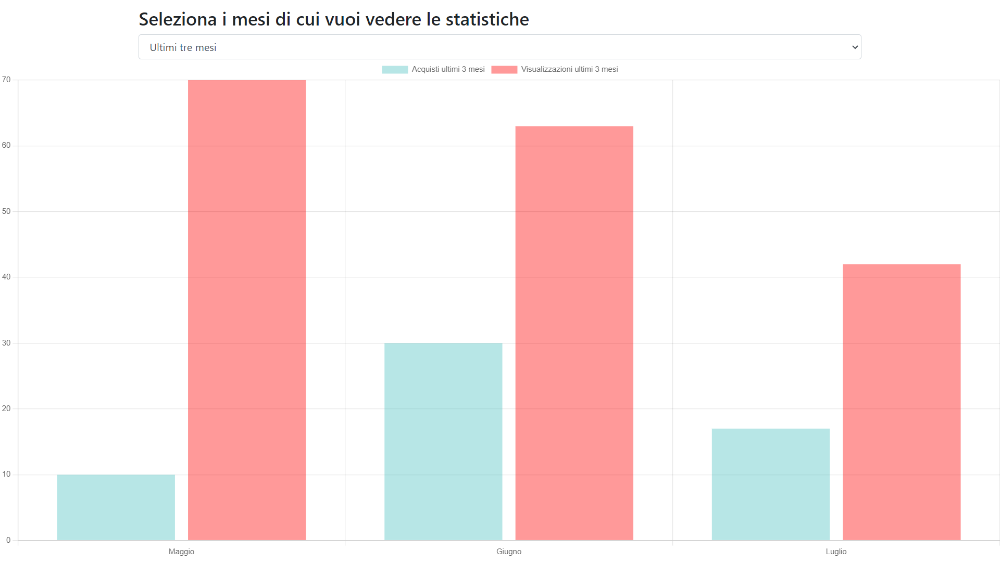
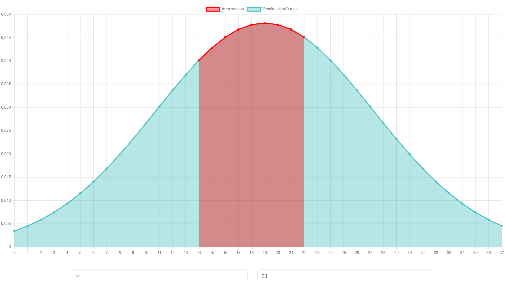

# AliceInBeautyland

[AliceInBeautyland](https://aliceinbeautyland.altervista.org/) is an open-source website of a beauty center. It serves as the project for my high school diploma exam.

The aim of the application is to enable potential clients to register an account in order to buy products or book an appointment at the center.

The application is divided into two main parts:

* [Public area](#public-area) (visible to everyone)
* [Private admin area](#reserved-area) (visible only to privileged accounts)

## Public area

The public area consists of:
* [Home](#home)
* [Shop](#shop)
* [Bookings](#bookings)
* [Login](#login)

### Home

The home page serves as the main page of the website, providing essenntial information about the beauty center.

### Shop

The shop page displays all products available for purchase on the website. It also allows users to use search filters to find desired products.

From the shop, you can also see the details of a product and write a review.

### Bookings

On this page, once you log in, you can view all the available treatments offered by the center and make bookings.

### Login

This simple login page allows clients to register a new account or log into an existing one.

## Reserved area

The reserved area consists of:
* [Manage shop](#manage-shop-and-bookings)
* [Manage bookings](#manage-shop-and-bookings)
* [Reviews](#reviews)
* [Analytics](#analytics)

### Manage shop and bookings

These pages are quite similar, allowing the admin to add, remove and update bookable treatments, products available for purchase, and selectable categories.

The admin can also view all booked treatments for a specific day, ordered chronologically.

### Reviews

This page lists all available products, and the admin can select a product to view its reviews.

### Analytics

From this section, the admin can choose a product and see a useful chart displaying the total number of visualizations and the total number of purchases month by month.

Additionally, another chart displays a probability distribution of sales, based on data gathered during previous months.

## Created with
* `HTML`,
* `CSS`,
* `Javascript`,
* `PHP`,
* `MySQL`,
* `Chart.js`.
